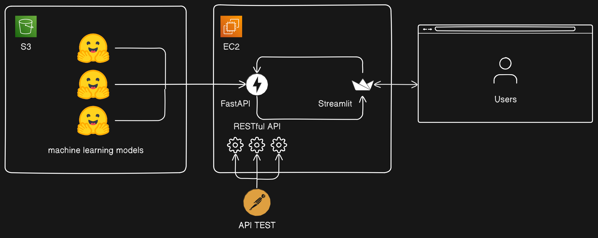

# Multi-Task Classification API

This web application provides a RESTful API and interface for classifying both text and image data using multiple machine learning models. The application is designed to efficiently manage and serve different classification tasks through a unified API.

## Table of Contents
1. [Models Used and Purpose](#models-used-and-purpose)
2. [Multi-Task API Structure](#multi-task-api-structure)
3. [Architecture](#architecture)
4. [Data Validation and API Testing](#data-validation-and-api-testing)
5. [Deployment](#deployment)
6. [Tools Used](#tools-used)

## Models Used and Purpose

### Sentiment Classification Model
- **Dataset**: IMDb movie reviews
- **Purpose**: Classify movie reviews as positive or negative.

### Disaster Tweet Classification Model
- **Purpose**: Determine whether a tweet is related to a disaster.

### Human Pose Classification Model
- **Purpose**: Classify human actions (e.g., standing, sitting) from image data.

These models are implemented using BERT and its lightweight version, Tiny BERT. Tiny BERT is optimized to maintain high accuracy while minimizing resource consumption. The models are trained using HuggingFace tools and are stored on Amazon S3. The server downloads the models from S3 and serves them to users via the FastAPI framework.

## Multi-Task RESTful API Structure

This web application integrates multiple models into a single API, allowing users to perform various classification tasks through a single interface. For example, users can send a request to specific endpoints to perform sentiment classification, disaster tweet classification, or human pose classification.

## Architecture

- **FastAPI and Uvicorn Server**: The application is built using the FastAPI framework, which is a fast and lightweight web framework for Python. FastAPI is paired with the Uvicorn server to provide a high-performance API.
  
- **ML Model Integration**: When FastAPI receives a request, it passes the input data to the appropriate machine learning model to generate classification results. The response is then returned to the user, tailored to the specific task.

- **User Interface**: A simple web interface is created using Streamlit, allowing users to easily interact with the API. Users can perform sentiment classification, disaster tweet classification, and human pose classification with ease.

## Data Validation and API Testing

- **Data Validation with Pydantic**: FastAPI utilizes Pydantic to define data models and validate the integrity of the data sent to the API. This ensures that only accurate data enters the system.
  
- **API Testing**: Tools like POSTMAN are used to test the API to ensure that it operates as expected.

## Deployment

- **Deployment on AWS EC2**: The models and API are deployed on an AWS EC2 server, making them accessible in a production environment. This allows users to access the API over the internet and utilize the models for various tasks.

## Tools Used

- **FastAPI**: A modern, fast (high-performance) web framework for building APIs with Python 3.8+.
- **Uvicorn**: A lightning-fast ASGI server for serving FastAPI applications.
- **Streamlit**: A framework for creating interactive web applications with Python.
- **HuggingFace Transformers**: A library for state-of-the-art NLP models like BERT and Tiny BERT.
- **Pydantic**: Data validation and settings management using Python type annotations.
- **POSTMAN**: A popular tool for testing APIs.
- **AWS S3**: Amazon's cloud storage service for storing and retrieving models.
- **AWS EC2**: Amazon's cloud computing service for deploying the application.
- **Docker** (optional): Containerization tool for packaging applications and dependencies.

