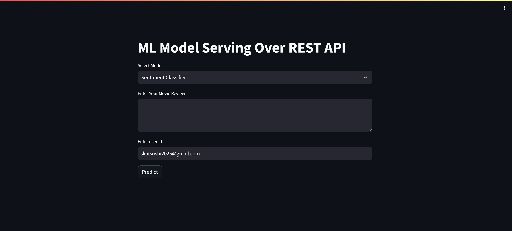

# マルチタスク分類ウェブアプリケーション

このウェブアプリケーションは、機械学習を利用して、テキストデータと画像データの分類を行うためのRESTful APIとインターフェースを提供します。アプリケーションは、複数の分類タスクを統合的に管理し、効率的に提供することを目的としています。

## 目次
1. [使用するモデルとその目的](#使用するモデルとその目的)
2. [マルチタスクAPIの構造](#マルチタスクAPIの構造)
3. [アーキテクチャ](#アーキテクチャ)
4. [データ検証とAPIテスト](#データ検証とAPIテスト)
5. [デプロイメント](#デプロイメント)
6. [使用ツール](#使用ツール)

## 使用するモデルとその目的

### 感情分類モデル
- **目的**: 映画レビューをポジティブまたはネガティブに分類する。

### 災害ツイート分類モデル
- **目的**: ツイートが災害に関連しているかどうかを判断する。

### 人間のポーズ分類モデル
- **目的**: 画像データから人間の行動（例：立っている、座っているなど）を分類する。

これらのモデルはBERTとその軽量版であるTiny BERTを使用して実装されています。Tiny BERTはリソース消費を最小限に抑えつつ高精度を維持するように最適化されています。モデルはHuggingFaceツールを使用してトレーニングされ、Amazon S3に保存されています。サーバーはS3からモデルをダウンロードし、FastAPIフレームワークを通じてユーザーに提供します。

## マルチタスクAPIの構造

このウェブアプリケーションは、複数のモデルを単一のAPIに統合し、ユーザーが単一のインターフェースを通じて様々な分類タスクを実行できるようにしています。たとえば、ユーザーは特定のエンドポイントにリクエストを送信して、センチメント分類、災害ツイート分類、人間のポーズ分類を行うことができます。

## アーキテクチャ

- **FastAPIとUvicornサーバー**: アプリケーションはFastAPIフレームワークを使用して構築されており、これは高速で軽量なPython用のウェブフレームワークです。FastAPIはUvicornサーバーと組み合わせて使用され、高性能なAPIを提供します。

- **MLモデル統合**: FastAPIがリクエストを受け取ると、適切な機械学習モデルに入力データを渡して分類結果を生成します。結果はユーザーに返され、特定のタスクに合わせて調整されます。

- **ユーザーインターフェース**: Streamlitを使用して簡単なウェブインターフェースを作成し、ユーザーがAPIと簡単に対話できるようにしています。ユーザーはセンチメント分類、災害ツイート分類、人間のポーズ分類を簡単に実行できます。

## データ検証とAPIテスト

- **Pydanticによるデータ検証**: FastAPIはPydanticを使用してデータモデルを定義し、APIに送信されるデータの整合性を検証します。これにより、正確なデータのみがシステムに入ることが保証されます。

- **APIテスト**: POSTMANなどのツールを使用してAPIをテストし、期待通りに動作することを確認します。

## デプロイメント

- **AWS EC2へのデプロイメント**: モデルとAPIはAWS EC2サーバーにデプロイされ、これにより本番環境でアクセスできるようになります。これにより、インターネット経由でAPIにアクセスし、様々なタスクにモデルを活用することができます。

## 使用ツール

- **FastAPI**: Python 3.8+でAPIを構築するための現代的で高速なウェブフレームワーク。
- **Uvicorn**: FastAPIアプリケーションを提供するための超高速ASGIサーバー。
- **Streamlit**: Pythonでインタラクティブなウェブアプリケーションを作成するためのフレームワーク。
- **HuggingFace Transformers**: BERTやTiny BERTなどの最先端NLPモデルのためのライブラリ。
- **Pydantic**: Pythonの型アノテーションを使用したデータ検証と設定管理。
- **POSTMAN**: APIのテストに人気のあるツール。
- **AWS S3**: モデルを保存および取得するためのAmazonのクラウドストレージサービス。
- **AWS EC2**: アプリケーションをデプロイするためのAmazonのクラウドコンピューティングサービス。
- **Docker** (オプション): アプリケーションと依存関係をパッケージ化するためのコンテナ化ツール。
- **AWS S3**: Amazon's cloud storage service for storing and retrieving models.
- **AWS EC2**: Amazon's cloud computing service for deploying the application.
- **Docker** (optional): Containerization tool for packaging applications and dependencies.

